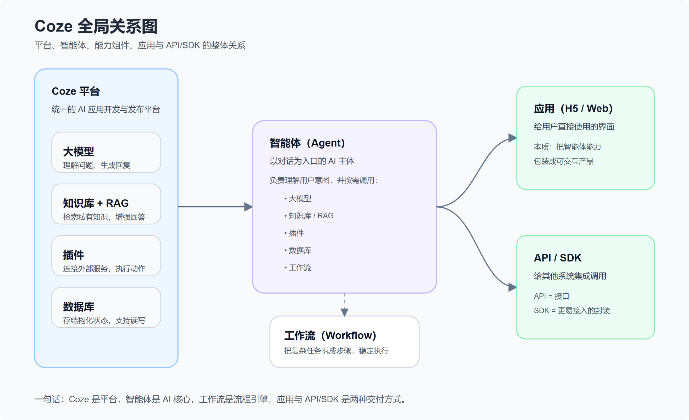
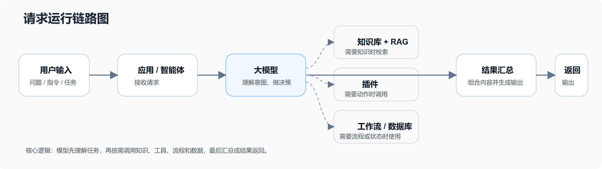
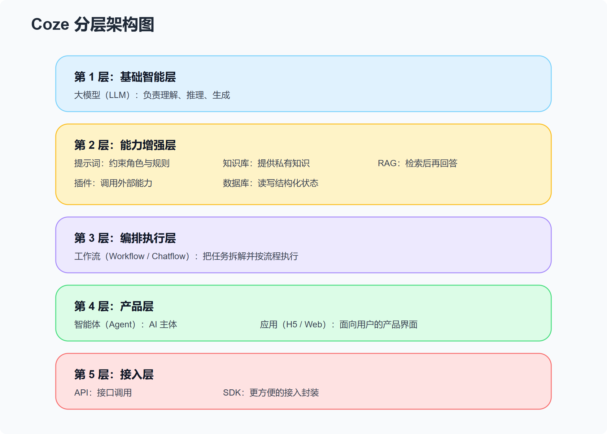

# Coze AI 智能体开发与本地 Demo

> **Coze 是 AI 应用开发平台；智能体/应用是产物；大模型是大脑；知识库 + RAG 负责知识增强；数据库负责状态存储；插件负责调用外部能力；工作流负责流程编排；API/SDK 负责对外接入。**

## 1. 关系图







------

## 2. 基本概念

- **Coze：** AI 应用开发平台，用来搭建、编排、发布智能体和应用。
- **大模型：** 底层推理引擎，负责理解输入和生成输出。
- **智能体（Agent）：** 面向用户交互的 AI 主体，会调用模型、知识库、插件、工作流等能力完成任务。
- **知识库：** 存放文档、FAQ、手册等非结构化知识内容，用于问答和检索。
- **RAG：** 检索增强生成：先从知识库检索相关内容，再交给模型回答，减少幻觉。
- **数据库：** 存储结构化业务数据，支持增删改查，适合订单、用户、状态等信息。
- **插件：** 连接外部服务的能力接口，让 AI 能查天气、搜网页、发消息、调用业务系统。
- **工作流：** 把多个步骤按顺序或条件编排起来，保证任务执行更稳定、可控。
- **应用（H5 / Web）：** 给用户直接使用的产品界面，本质上是把智能体能力包装成可交互页面。
- **API：** 把 AI 能力暴露给其他系统调用的接口。
- **SDK：** 对 API 的封装工具包，方便开发者更快集成。

------

## 3. 仓库中的 Demo

这个仓库主要记录 Coze AI 智能体开发过程中，本地代码如何接入和落地。当前包含 3 个 Demo：

### 3.1 成语接龙智能体 (`Idiom Chain`)

**功能：** 用户输入成语，智能体继续接龙。

<video src="Idiom Chain/演示效果.mp4" controls width="600"> </video>

### 3.2 历史海报生成智能体 (`history`)

**功能：** 用户输入历史人物、事件或典故，会生成对应海报（存储于我的 OSS）和历史信息总结。

<video src="history/演示效果.mp4" controls width="600"> </video>

### 3.3 动物视频生成智能体 (`animal`)

**功能：** 用户输入动物相关描述，生成对应视频（存储于我的 OSS）。

<video src="animal/演示效果.mp4" controls width="600"> </video>

## 4. Coze Python SDK 常用接口

本项目使用 `cozepy` SDK 调用 Coze 平台能力，以下是常用接口汇总：

### 4.1 客户端初始化

```python
from cozepy import Coze, TokenAuth, COZE_CN_BASE_URL

coze = Coze(
    auth=TokenAuth(token="your_api_token"),
    base_url=COZE_CN_BASE_URL,  # 国内版使用 COZE_CN_BASE_URL
)
```

### 4.2 工作空间与智能体

```python
# 列出当前账号可访问的工作空间
spaces = coze.workspaces.list()

# 列出指定工作空间下的智能体
bots = coze.bots.list(space_id="your_space_id")
```

### 4.3 对话管理

```python
from cozepy import Message, ChatStatus

# 创建对话
chat = coze.chat.create(
    bot_id="your_bot_id",
    user_id="your_user_id",
    additional_messages=[
        Message(
            role="user",
            content="你好",
            content_type="text",
            type="question",
        )
    ],
    auto_save_history=True,
)

# 查询对话状态
chat = coze.chat.retrieve(
    conversation_id=chat.conversation_id,
    chat_id=chat.id,
)

# 轮询等待对话完成
while chat.status == ChatStatus.IN_PROGRESS:
    chat = coze.chat.retrieve(
        conversation_id=chat.conversation_id,
        chat_id=chat.id,
    )

# 获取对话消息
messages = coze.chat.messages.list(
    conversation_id=chat.conversation_id,
    chat_id=chat.id,
)
```

### 4.4 消息类型

| 类型 | 说明 |
|------|------|
| `question` | 用户提问 |
| `answer` | 智能体回答 |
| `tool_response` | 工具/插件调用结果 |
| `follow_up` | 追问建议 |

### 4.5 对话状态

| 状态 | 说明 |
|------|------|
| `ChatStatus.IN_PROGRESS` | 对话进行中 |
| `ChatStatus.COMPLETED` | 对话已完成 |
| `ChatStatus.FAILED` | 对话失败 |

---

## 5. 已发布可直接体验的智能体与应用

- **智能体 ｜ 健康生活小助手：** https://www.coze.cn/s/lh4FSes6vgo/
- **智能体 ｜ 成语接龙：** https://www.coze.cn/s/cF-wjIYwrSA/
- **智能体 ｜ 历史海报制作：** https://www.coze.cn/s/uZEhaEMoqg0/
- **应用 ｜ 历史海报生成器：** https://www.coze.cn/s/X81p7mi46fM/
- **应用 ｜ 动物视频生成器：** https://www.coze.cn/s/0FpSgEY235Y/
- **智能体 ｜ 动物视频生成：** https://www.coze.cn/s/GdxSYIwXcjg/

> **注意：** 由于安全和成本考虑，OSS 存储服务已于 2026 年 4 月关闭。上述依赖 OSS 存储的智能体与应用（历史海报制作、动物视频生成等）将无法正常使用，敬请谅解！